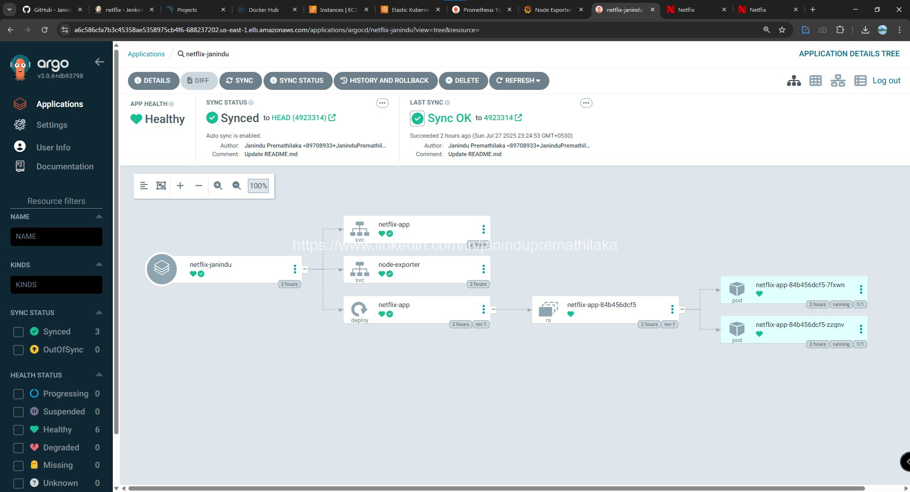
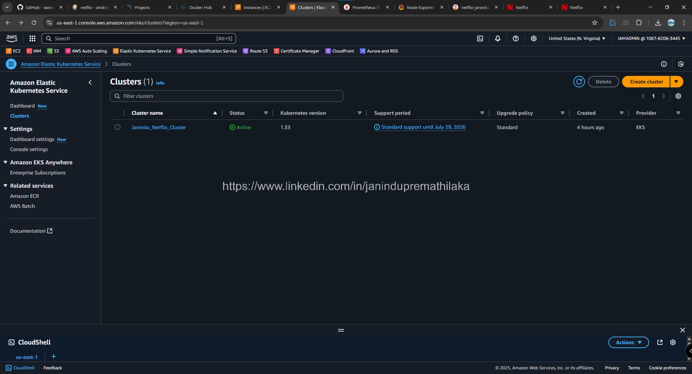

  

   
  

 

  
  
Home Page

 

  
  
Jenkins Pipline & stages view

 

  
  
Jenkins Pipline & stages view

 

  
  
Dockerhub push

 

  
  
Argocd

 

  
  
cluster

 

  
  
Cluster details

 

  
  
Prometheus

 

  
  
Grafana dashbaord

 

  
  
Runing Instances

 

  

 

# 💡 DevSecOps CI/CD Pipeline Project - Netflix Clone

This is a **hands-on DevSecOps project** I personally implemented using my own AWS resources, GitHub repository, and DevOps toolchain. The goal was to build, secure, monitor, and deploy a Netflix Clone application using a complete CI/CD pipeline with tools such as **Jenkins**, **Docker**, **SonarQube**, **Trivy**, **OWASP Dependency Check**, **Prometheus**, **Grafana**, **ArgoCD**, and **Kubernetes (EKS)**.

> 📌 [GitHub Repository](https://github.com/JaninduPremathilaka/DevSecOps-Netflix-Pipeline-Project)

---

## 🚀 Tools & Technologies Used
- **AWS EC2, S3, IAM, EKS**
- **Jenkins** (CI/CD automation)
- **Docker** (containerization)
- **SonarQube** + **Trivy** (code quality & image scanning)
- **OWASP Dependency-Check**
- **Prometheus & Grafana** (monitoring)
- **ArgoCD** (Kubernetes GitOps deployment)
- **Helm**, **Kubernetes**, **Node Exporter**

---

## 🛠️ Why I Built This

As a DevOps enthusiast, I wanted to practically apply my knowledge and demonstrate my understanding of the full DevSecOps lifecycle. This project allowed me to:
- Practice secure CI/CD pipelines from scratch
- Set up real-time monitoring with Prometheus and Grafana
- Explore GitOps deployment with ArgoCD and Kubernetes
- Gain hands-on exposure to integrating static code analysis and container security

---

